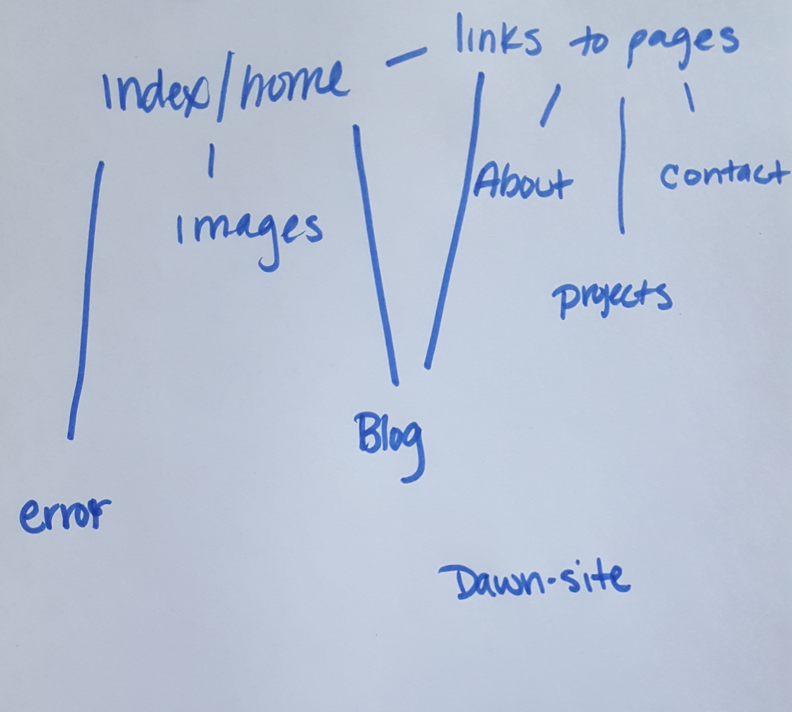
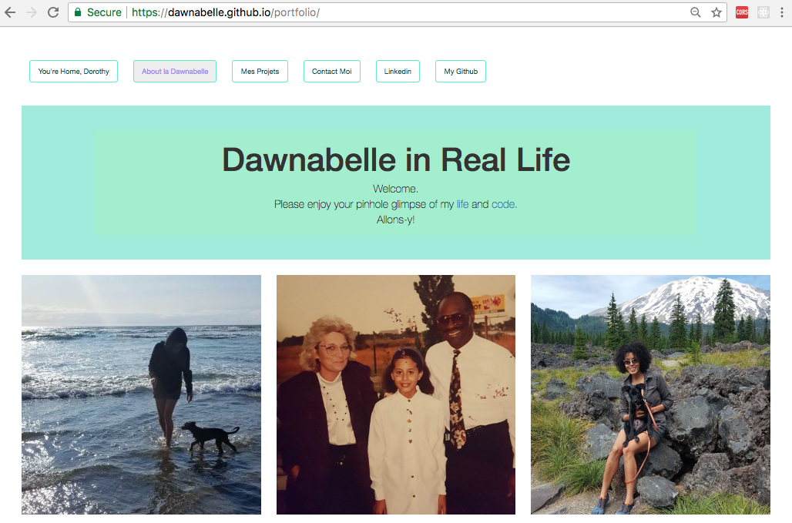
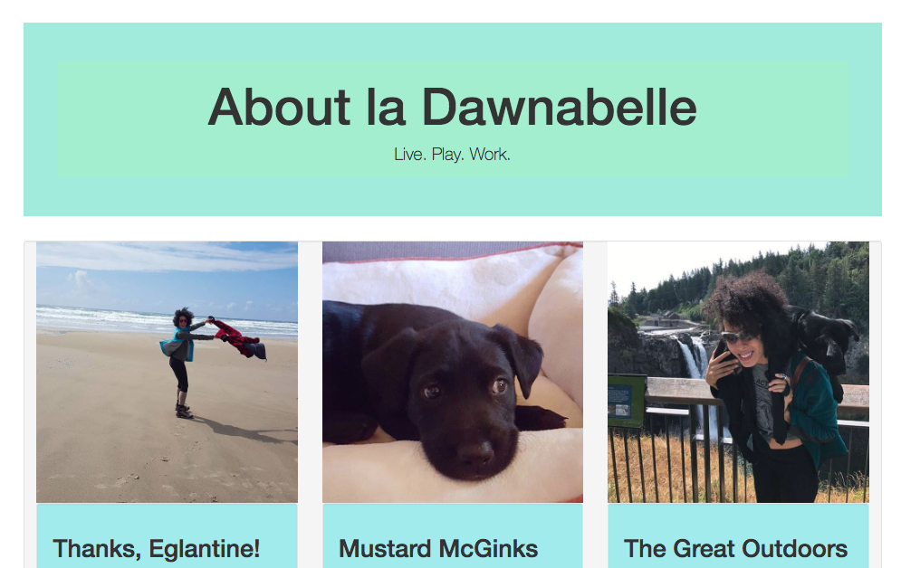
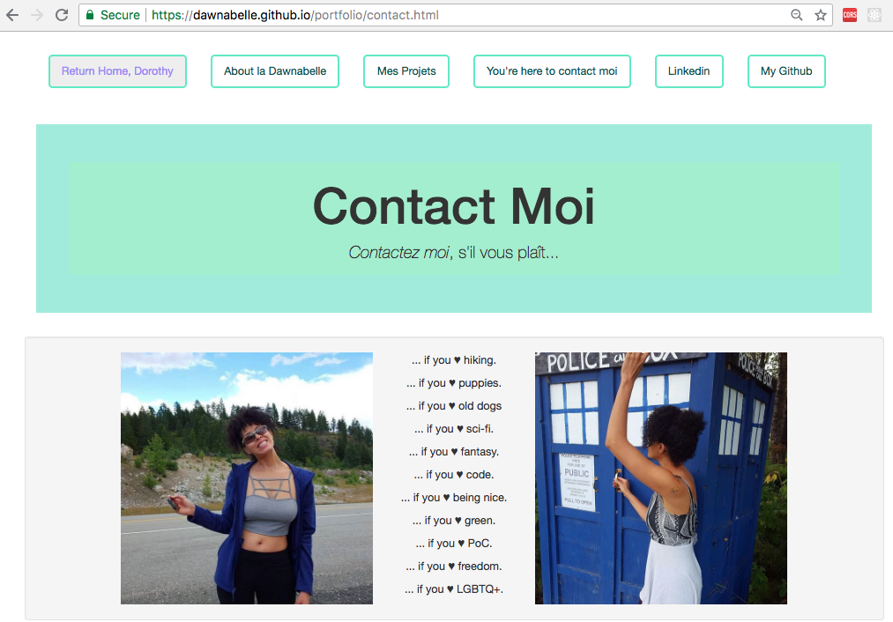
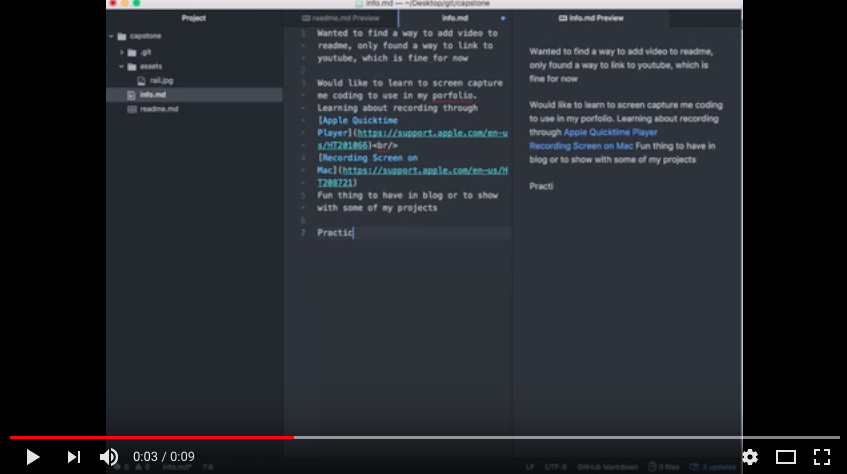
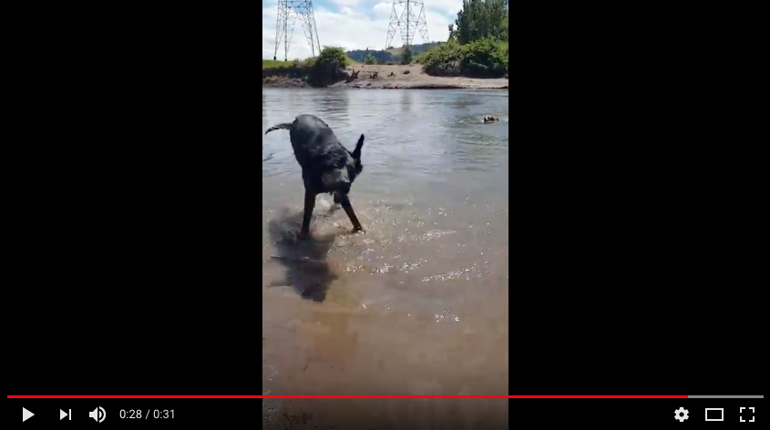

## Capstone Planning Day
_Capstone being built at_ [Dawn-Site]( https://github.com/Dawnabelle/dawn-site)

### Thoughts for the day (7/20/18) ready for you [at the More Info page](/more-info.md)

#### Thoughts for the day (7/13/18) ready for you [at the Info page](/info.md)

### Original Capston Proposal [at the Proposal page](/proposal.md)

### Component Tree
</a>
 

#### Sketch Mockup  
Remake my original portfolio site, but better!
 
</a>
 
</a>
 
</a>
 
Mobile sketch of portfolio site
 
</a>
 

### Learning to add video to readme files

First attempt at screen recording
 

Mustard swimming
 

